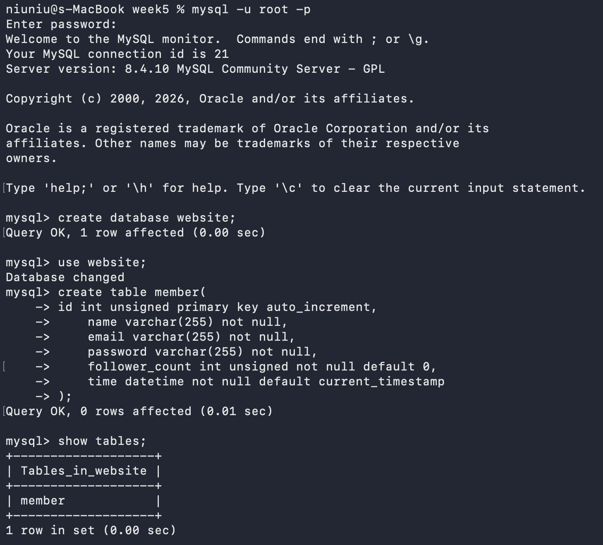
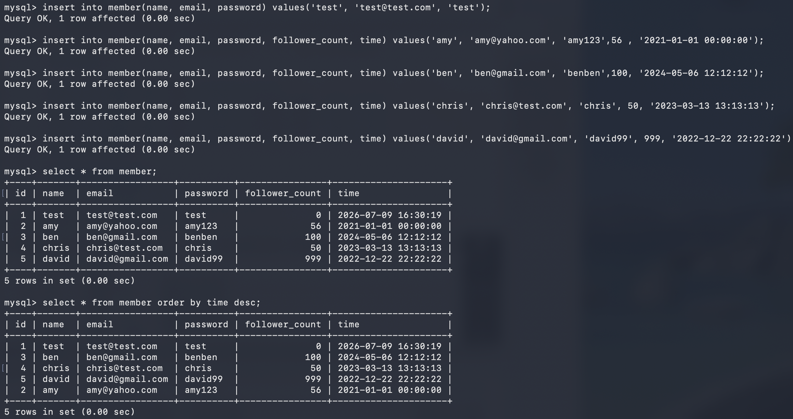
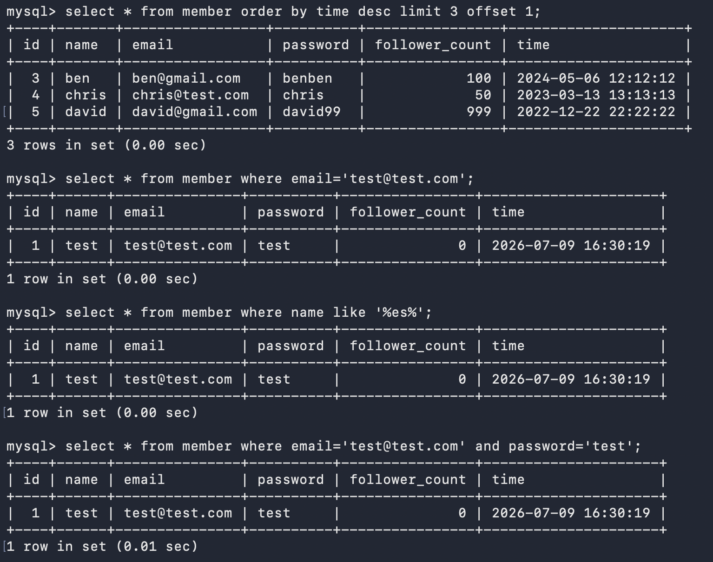
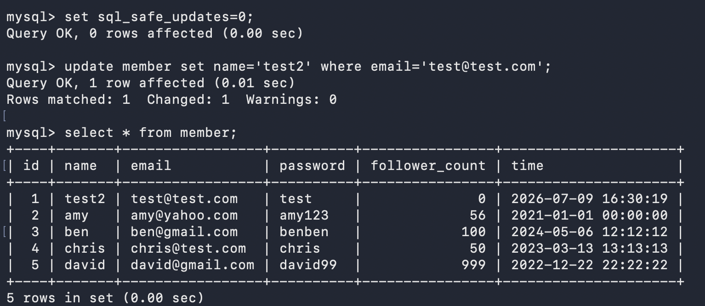
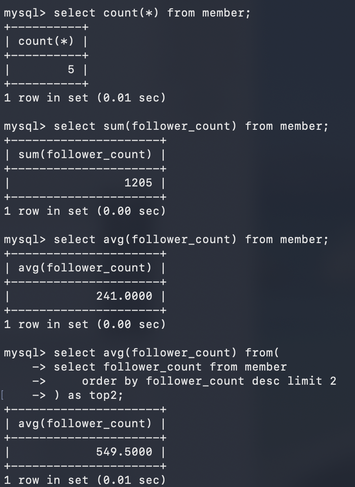
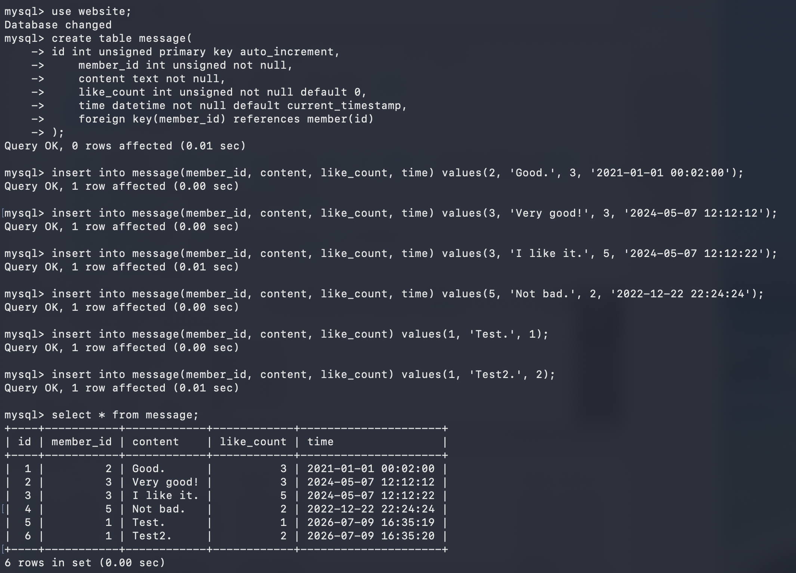
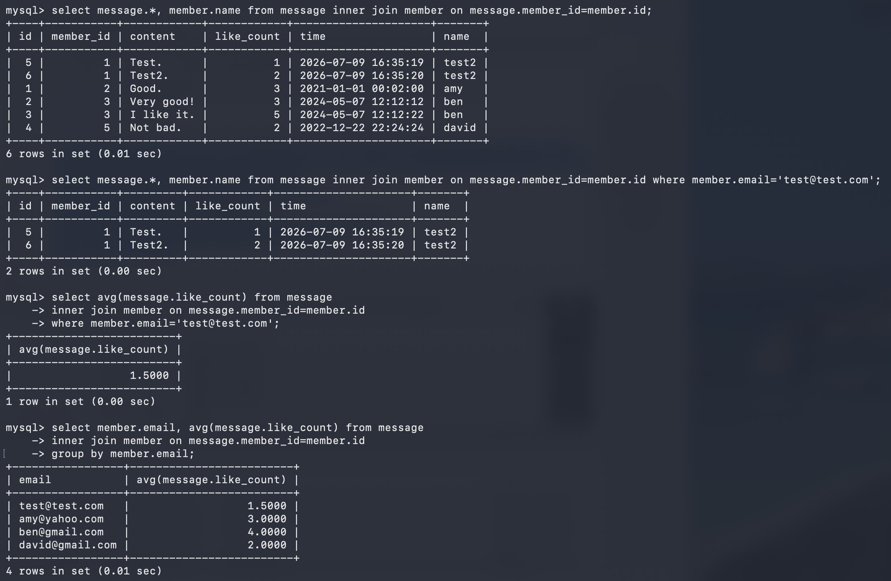

## Task 2

```sql
create database website;
use website;
create table member(
    id int unsigned primary key auto_increment,
    name varchar(255) not null,
    email varchar(255) not null,
    password varchar(255) not null,
    follower_count int unsigned not null default 0,
    time datetime not null default current_timestamp
);
show tables;
```



## Task 3

```sql
insert into member(name, email, password) values('test', 'test@test.com', 'test');
insert into member(name, email, password, follower_count, time) values('amy', 'amy@yahoo.com', 'amy123',56 , '2021-01-01 00:00:00');
insert into member(name, email, password, follower_count, time) values('ben', 'ben@gmail.com', 'benben',100, '2024-05-06 12:12:12');
insert into member(name, email, password, follower_count, time) values('chris', 'chris@test.com', 'chris', 50, '2023-03-13 13:13:13');
insert into member(name, email, password, follower_count, time) values('david', 'david@gmail.com', 'david99', 999, '2022-12-22 22:22:22');

select * from member;
select * from member order by time desc;
select * from member order by time desc limit 3 offset 1;
select * from member where email='test@test.com';
select * from member where name like '%es%';
select * from member where email='test@test.com' and password='test';
set sql_safe_updates=0;
update member set name='test2' where email='test@test.com';
```





## Task 4

```sql
select count(*) from member;
select sum(follower_count) from member;
select avg(follower_count) from member;
select avg(follower_count) from(
	select follower_count from member
    order by follower_count desc limit 2
) as top2;
```



## Task 5

```sql
use website;
create table message(
	id int unsigned primary key auto_increment,
    member_id int unsigned not null,
    content text not null,
    like_count int unsigned not null default 0,
    time datetime not null default current_timestamp,
    foreign key(member_id) references member(id)
);

insert into message(member_id, content, like_count, time) values(2, 'Good.', 3, '2021-01-01 00:02:00');
insert into message(member_id, content, like_count, time) values(3, 'Very good!', 3, '2024-05-07 12:12:12');
insert into message(member_id, content, like_count, time) values(3, 'I like it.', 5, '2024-05-07 12:12:22');
insert into message(member_id, content, like_count, time) values(5, 'Not bad.', 2, '2022-12-22 22:24:24');
insert into message(member_id, content, like_count) values(1, 'Test.', 1);
insert into message(member_id, content, like_count) values(1, 'Test2.', 2);
select * from message;

select message.*, member.name from message inner join member on message.member_id=member.id;
select message.*, member.name from message inner join member on message.member_id=member.id where member.email='test@test.com';
select avg(message.like_count) from message
inner join member on message.member_id=member.id
where member.email='test@test.com';
select member.email, avg(message.like_count) from message
inner join member on message.member_id=member.id
group by member.email;
```



